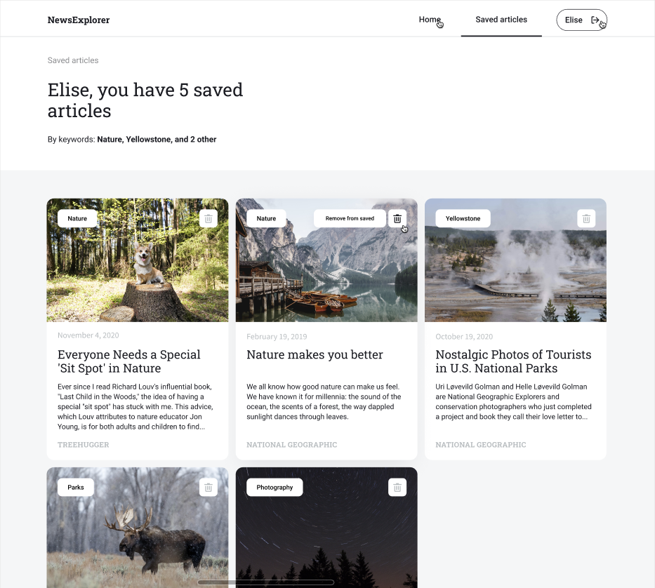
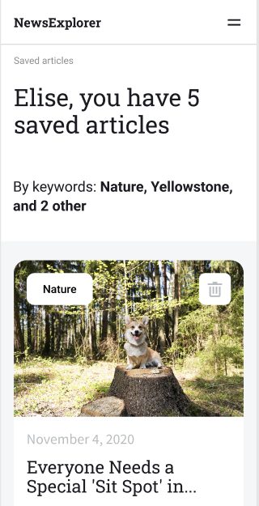

# The News Explorer!
> A portfolio project featuring data from newsapi.org, a custom built express server, and a frontend interface built with React.js

Visit the live site [here](http://danny-around-react.students.nomoreparties.site)

This application features token-based authentication, data from the popular API-as-a-service "newsapi.org", and private data storage on a custom built ExpressJS server (view the repository [here](https://github.com/ddemosi/news-explorer-api)). It also features a "sorting" method that will analyze the cards you've searched/saved into your account and rank them based on the most popular keywords. You can view this feature after signing up and saving some news articles into your account. 



It also features responsive design easily used on mobile devices.

Mobile:




## Installation

After clone, make sure you have node.js installed. Run:

```sh
npm install
```

Then run:

```sh
npm run start
```


## NOTE:

DO NOT REGISTER USING ANY SENSITIVE DATA

This is a portfolio project built for demonstration purposes only and is NOT secured. By default, the server allows all requests from localhost:3000, so anyone with an active development server can access it.

## Meta

Daniel Gummow (dannydemosi) – [LinkedIn](https://www.linkedin.com/in/daniel-gummow-223043186/) – rdgummow@gmail.com

[Github](https://github.com/ddemosi/)
